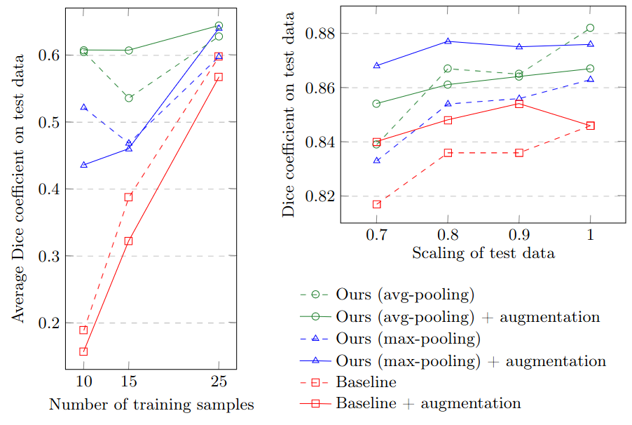

## Scale-Equivariant Deep Learning for 3D Data

This repository contains the code used in the paper *Scale Equivariant Deep Learning for 3D Data* by [Thomas
Wimmer](https://wimmerth.github.io/), [Vladimir Golkov](https://cvg.cit.tum.de/members/golkov), [Hoai Nam Dang](https://www.mr-physik.med.fau.de/en/team/hoai-nam-dang/), [Moritz
Zaiss](https://mzaiss.cest-sources.org/index.php/en/), [Andreas Maier](https://lme.tf.fau.de/person/maier/), and [Daniel Cremers](https://cvg.cit.tum.de/members/cremers).

### Abstract

> The ability of convolutional neural networks (CNNs) to recognize objects regardless of their position in the image is
> due to the translation-equivariance of the convolutional operation. Group-equivariant CNNs transfer this equivariance
> to
> other transformations of the input. Dealing appropriately with objects and object parts of different scale is
> challenging, and scale can vary for multiple reasons such as the underlying object size or the resolution of the
> imaging
> modality.
>
>In this paper, we propose a scale-equivariant convolutional network layer for three-dimensional data that guarantees
> scale-equivariance in 3D CNNs.
> Scale-equivariance lifts the burden of having to learn each possible scale separately, allowing the neural network to
> focus on higher-level learning goals, which leads to better results and better data-efficiency.
>
>We provide an overview of the theoretical foundations and scientific work on scale-equivariant neural networks in the
> two-dimensional domain. We then transfer the concepts from 2D to the three-dimensional space and create a
> scale-equivariant convolutional layer for 3D data.
>
>Using the proposed scale-equivariant layer, we create a scale-equivariant U-Net for medical image segmentation and
> compare it with a non-scale-equivariant baseline method. Our experiments demonstrate the effectiveness of the proposed
> method in achieving scale-equivariance for 3D medical image analysis.
>

### Setup

The repository does not contain an 'environment.yml' file but instead [detailed instructions](environment.txt) to setup
the [conda](https://www.anaconda.com/) environment manually as this proved to be better working. This environment is
needed to run the training and experiments with the given scripts, but the layers themselves should be usable with any
PyTorch / NumPy version in a custom project.

Training was performed for up to 160 epochs, depending on the size of the training set, using an NVIDIA RTX 8000 GPU, up
to 5 GB VRAM and 10 GB RAM. The training lasted about 2 hours on average.

### Repository structure

The _layers_-folder contains the implementation of scale-equivariant convolutional layers for 3D.
The _models_-folder contains the implementations of a baseline model, and a scale-equivariant U-Net.
The models are created using [PyTorch Lightning](https://www.pytorchlightning.ai/) and can be trained using the _run.py_
files in the according modules.
